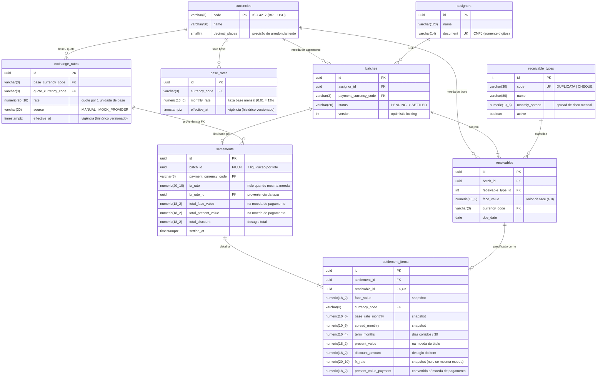

# Modelo de Dados — SRM Credit Engine

Modelo relacional (PostgreSQL 16) que sustenta a precificação e liquidação de recebíveis multimoedas. O DDL completo está em [`ddl.sql`](./ddl.sql), gerado a partir das migrations Alembic.

## Diagrama ER

## Decisões de modelagem

1. **Dinheiro e taxas em `NUMERIC`, nunca float** — `NUMERIC(18,2)` para valores monetários, `NUMERIC(20,10)` para taxas de câmbio e `NUMERIC(10,6)` para taxas mensais. Toda aritmética na aplicação usa `Decimal`.
2. **Taxas versionadas por vigência** — `exchange_rates` e `base_rates` são *append-only*: cada atualização insere um novo registro com `effective_at`, preservando o histórico para auditoria (a taxa vigente é a de maior `effective_at`). Unicidade por `(par, effective_at)` impede ticks duplicados.
3. **Snapshot completo na liquidação** — `settlement_items` grava **todos os insumos da fórmula** (taxa base, spread, prazo, taxa FX) no momento da liquidação. Uma liquidação passada permanece explicável mesmo que taxas e spreads mudem depois — exigência típica de auditoria em FIDC.
4. **Optimistic locking** — `batches.version` é o token de controle de concorrência: a liquidação só progride se a versão lida ainda for a corrente (`UPDATE ... WHERE version = :v`), evitando liquidação dupla sem lock pessimista.
5. **Spread data-driven + Strategy no código** — o spread mora em `receivable_types` (negócio ajusta sem deploy); a *forma* do cálculo é selecionada por Strategy Pattern no domínio, chaveada pelo `code` do tipo.
6. **Status com CHECK constraint** (`PENDING`/`SETTLED`) em vez de enum nativo do Postgres — evolução de valores sem `ALTER TYPE`, mantendo integridade no banco.
7. **Imutabilidade** — `settlements`/`settlement_items` não têm `updated_at`: são registros contábeis imutáveis por design; correções geram eventos novos, nunca updates.
